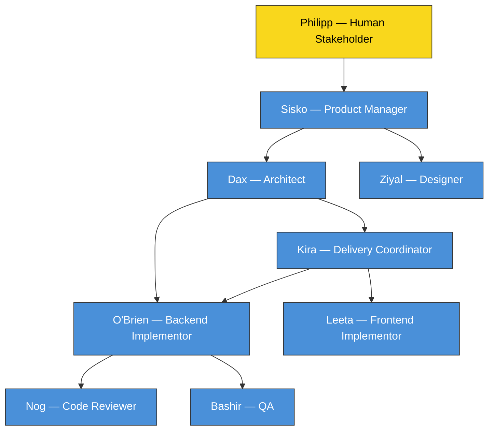
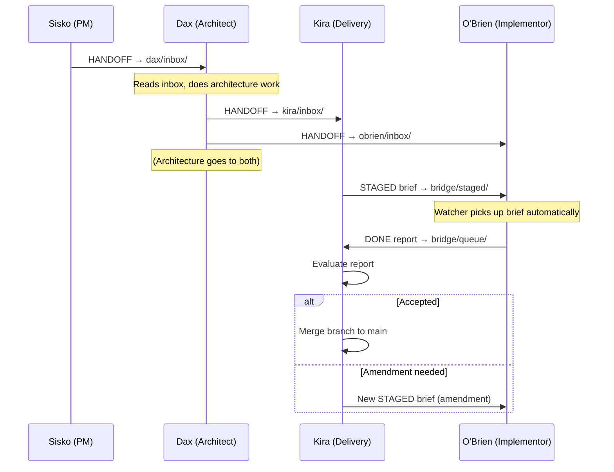
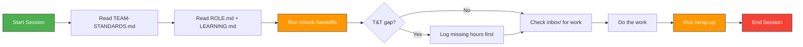
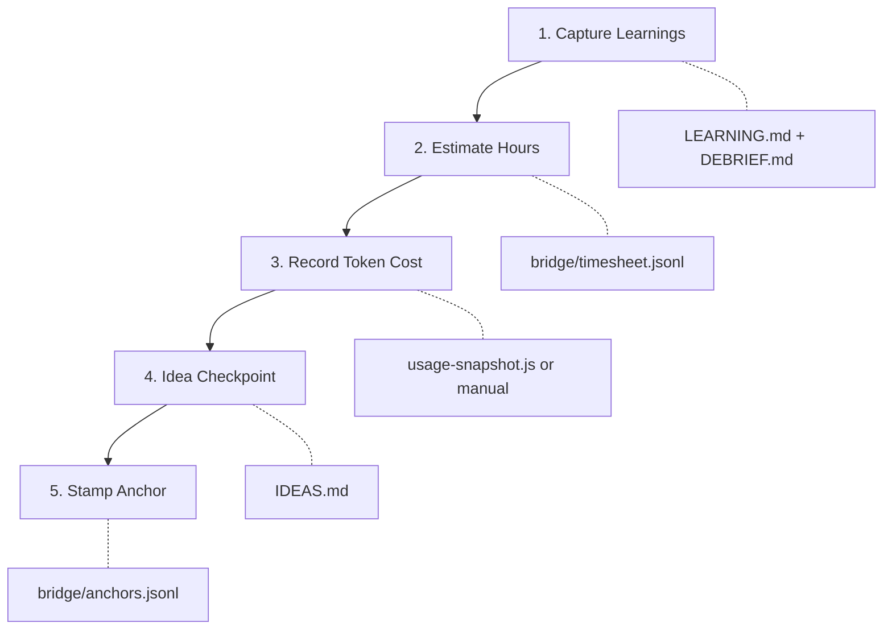
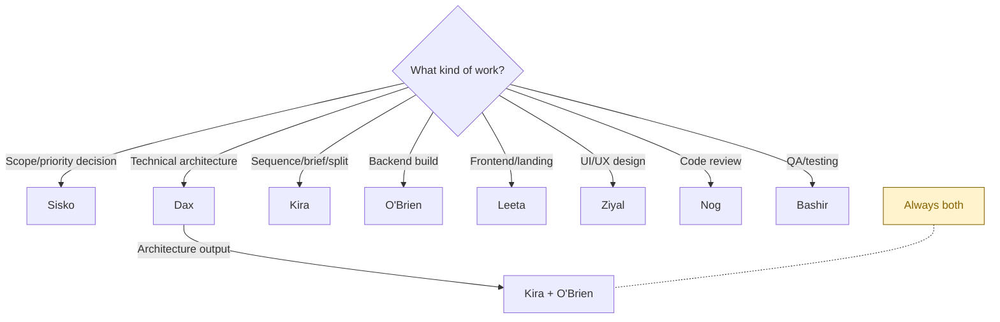

# Contributor Guide — The Liberation of Bajor

*How AI roles and humans collaborate in this project. Read this if you're new to the team or need a refresher on how things flow.*

---

## The Team

The Liberation of Bajor is an AI agent orchestration pipeline. One human (Philipp) works with a team of AI roles, each in its own Cowork session window.



Philipp (yellow) is the only human. All blue nodes are AI roles running in separate Cowork windows or Claude Code sessions.

---

## Role Folder Structure

Every role has a folder at `repo/.claude/roles/{role-name}/` with a consistent layout:

```
roles/
├── sisko/
│   ├── ROLE.md          ← Identity, responsibilities, decision rights
│   ├── LEARNING.md      ← Cross-project behavioral memory
│   └── inbox/           ← Incoming handoffs and responses
│       ├── HANDOFF-BET2-REQUIREMENTS.md
│       └── RESPONSE-ARCHITECTURE-FROM-DAX.md
├── dax/
│   ├── ROLE.md
│   ├── LEARNING.md
│   └── inbox/
│       └── ...
├── kira/
│   ├── ROLE.md
│   ├── LEARNING.md
│   └── inbox/
│       └── ...
└── ... (obrien, ziyal, leeta, nog, bashir)
```

**Three zones, one purpose each:**

| File/Folder | Purpose | Who writes it |
|---|---|---|
| `ROLE.md` | Identity — what this role is, what it decides | Sisko or Philipp |
| `LEARNING.md` | Memory — behavioral patterns learned across sessions | The role itself |
| `inbox/` | Work queue — incoming handoffs and responses from other roles | Other roles (via `/handoff-to-teammate`) |

---

## How Work Flows Between Roles



**Key rule:** Every role-to-role communication is a file. If it's not written down in the receiver's `inbox/`, it didn't happen.

---

## Session Lifecycle

Every role session follows the same pattern: start up, check inbox, work, wrap up.



### Session Start: `/check-handoffs`

1. **T&T self-audit** — checks `bridge/tt-audit.jsonl` for your last outbound handoff, then checks `bridge/timesheet.jsonl` for a matching timesheet entry after that timestamp. If missing, warns you to log hours before proceeding.
2. **Inbox scan** — lists all `HANDOFF-*.md` and `RESPONSE-*.md` in your `inbox/` folder, newest first.

### Session End: `/wrap-up`

Five steps, in order:



**Why this matters:** AI sessions start fresh. Context compaction destroys the texture of work — what was tried, how long it took, what surprised you. Wrap-up captures this into durable files while the details still exist. Run it before the session ends, not after.

---

## The Handoff Protocol

When one role needs something from another role, they run `/handoff-to-teammate`. This does four things automatically:

1. **Writes the artifact** — a markdown file in the receiver's `inbox/`
2. **Logs economics** — one timesheet entry for all work done this session
3. **Stamps an anchor** — a marker in `bridge/anchors.jsonl` so the reporting agent knows where to start
4. **Reports to the user** — tells Philipp which role to open next

### Artifact naming

| Type | Pattern | Example |
|---|---|---|
| Handoff | `inbox/HANDOFF-{description}.md` | `kira/inbox/HANDOFF-BET3-SLICING.md` |
| Response | `inbox/RESPONSE-{description}-FROM-{role}.md` | `sisko/inbox/RESPONSE-ARCHITECTURE-FROM-DAX.md` |

### Routing rules



**Rule of thumb:** Technical work always goes to Dax before Kira. Kira should never receive raw technical requirements without architectural guidance.

---

## Economics Tracking

Every role logs time after completing significant work. Two halves of the equation:

| Metric | What it measures | Where it's logged |
|---|---|---|
| **Human hours** | What a competent human professional would bill for this work | `bridge/timesheet.jsonl` |
| **Token cost** | What the AI session actually cost in tokens/euros | `bridge/timesheet.jsonl` (via `usage-snapshot.js`) |

Together these give ROI: value created (human hours saved) vs. cost incurred (token spend).

### Timesheet entry (one per deliverable)

```json
{
  "ts": "2026-04-12T19:30:00Z",
  "role": "kira",
  "deliverable": "bet3-ops-center-polish",
  "phase": "fix",
  "brief_id": null,
  "task": "Fixed Ops history table...",
  "human_hours": 3.0,
  "human_role": "Senior Developer",
  "actual_minutes": 45,
  "notes": "Explanation of the estimate..."
}
```

### Automated tracking (O'Brien's sessions)

The watcher tracks O'Brien's token burn automatically — it captures `tokens_in`, `tokens_out`, and `cost_usd` from Claude Code's JSON output and writes them to `bridge/register.jsonl`.

### Manual tracking (Cowork role sessions)

Cowork roles (Dax, Kira, Sisko, Ziyal, Leeta) are invisible to the watcher. Their token cost is captured by `bridge/usage-snapshot.js`, which reads the Claude desktop app's usage API. This runs at session start (`/check-handoffs`) and session end (`/wrap-up` or `/handoff-to-teammate`).

---

## Skills Reference

Global skills every role has access to:

| Skill | Trigger | What it does |
|---|---|---|
| `/check-handoffs` | Session start, "check inbox" | T&T self-audit + inbox scan |
| `/handoff-to-teammate` | Passing work to another role | Write artifact + log economics + stamp anchor |
| `/wrap-up` | Session end, "wrap up" | Learnings + hours + cost + ideas + anchor |
| `/estimate-hours` | After completing work | Append timesheet entry |
| `/debrief` | When something is learned | Write to LEARNING.md or DEBRIEF.md |
| `/idea-capture` | When a future feature idea surfaces | Append to IDEAS.md |

---

## Quick Reference: Where Things Live

```
repo/
├── .claude/
│   ├── TEAM-STANDARDS.md      ← Entry point for every role
│   ├── roles/
│   │   └── {role}/
│   │       ├── ROLE.md        ← Identity
│   │       ├── LEARNING.md    ← Memory
│   │       └── inbox/         ← Incoming work
│   └── skills/
│       ├── check-handoffs/    ← Session start
│       ├── handoff-to-teammate/ ← Session end (with handoff)
│       ├── wrap-up/           ← Session end (without handoff)
│       ├── estimate-hours/    ← Economics
│       ├── debrief/           ← Learnings
│       └── idea-capture/      ← Ideas
├── bridge/
│   ├── timesheet.jsonl        ← All time/cost tracking
│   ├── anchors.jsonl          ← Session boundary markers
│   ├── tt-audit.jsonl         ← Outbound handoff log (for T&T audit)
│   ├── register.jsonl         ← O'Brien brief lifecycle events
│   ├── queue/                 ← Brief lifecycle files
│   ├── staged/                ← Briefs awaiting Philipp's approval
│   └── usage-snapshot.js      ← Cowork session cost capture
├── IDEAS.md                   ← Feature backlog (Sisko owns)
└── DEBRIEF.md                 ← Untriaged observations
```
